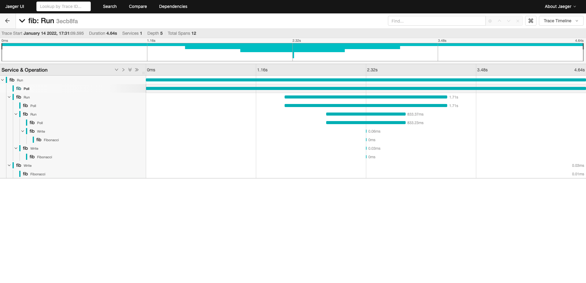

# Fibonacci
## Technology stack
- Opentelemetry
- Jaeger
- Prometheus

## Development
1. Run
- Run docker-compose and main.go: `make all`
- Run docker-compose down: `make down`
2. Test
- Jeager dashboard: http://localhost:16686
3. Screenshot

